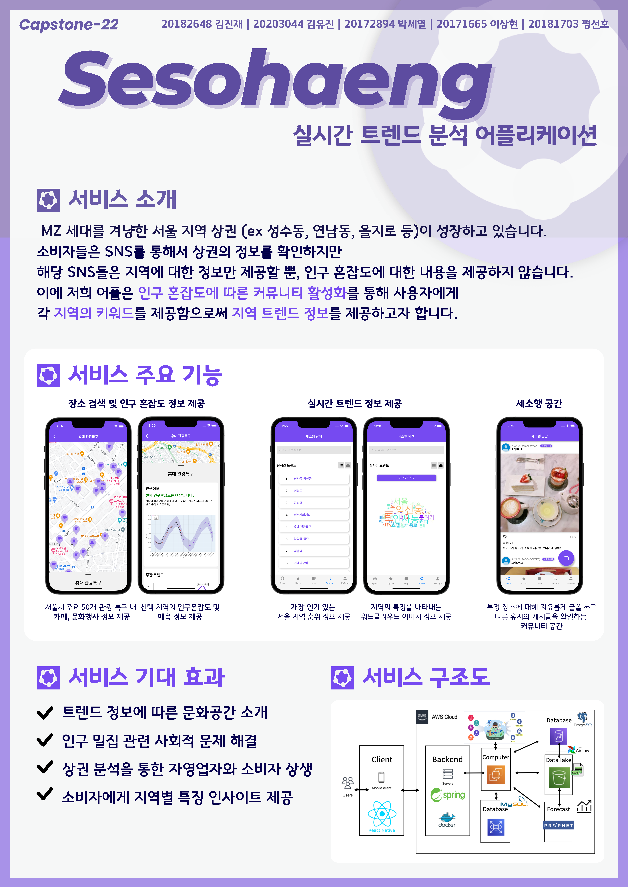

[](https://classroom.github.com/online_ide?assignment_repo_id=10029594&assignment_repo_type=AssignmentRepo)
# 2023년도 1학기 다학제간캡스톤디자인 I - 22팀
> 세상의 소소한 문화행복 생활을 즐기다, 세소행


## :question: 프로젝트 소개 & 팀 페이지



### 팀페이지 주소: [https://kookmin-sw.github.io/capstone-2023-22/](https://kookmin-sw.github.io/capstone-2023-22/)

프로젝트 소개 / 소개 영상 / 팀원 소개 / 사용법 등 프로젝트 정보들은 위의 링크에서 확인할 수 있습니다.

### 시연 영상

[시연 영상 링크](https://youtu.be/JS9QPI9w1qA)

## :evergreen_tree: 브랜치 설명

### Main

- master: Frontend / Backend / MLOps 의 메인 배포 코드, 보고서와 시연 동영상 등 주요 프로젝트 관련 내용을 담은 브랜치입니다.

### Frontend

- develop: Git flow 중 개발을 위한 branch입니다.<br />
( Frontend의 Git flow 중 develop 브랜치의 코드는 master 브랜치에서도 확인할 수 있습니다. )
- main: 실질 배포를 위한 branch입니다.
- feature: 개별 기능 단위 개발을 위한 branch입니다.

### Backend

- develop: Git flow 중 개발을 위한 branch입니다.<br />
( Backend의 Git flow 중 develop 브랜치의 코드는 master 브랜치에서도 확인할 수 있습니다. )
- main: 실질 배포를 위한 branch입니다.
- feature: 개별 기능 단위 개발을 위한 branch입니다.
    - response
    - exception
    - feed
    - security
    - entity
    - cafe,culture,area_maker

### MLOps

- main: 트렌드 WordCloud, S3 연계 등 주요 작업물 제출을 위한 branch입니다.<br />
( MLOps의 main branch 코드는 master 브랜치에서도 확인할 수 있습니다.)

## :raised_hands: 협업 규칙

### :ok_woman: commit 규칙

commit 메시지는 다음과 같은 양식으로 작성해주세요!

```
${add, feat, refactor, fix}: ${commit 설명}
```

### :raising_hand: Pull Request 규칙

Pull Request는 자유롭게 내용을 요약해서 보내시면 됩니다.
다만, Pull Request의 제목을 읽고 무슨 내용인지 명확하게 이해할 수 있어야 합니다.

### :notebook_with_decorative_cover: 기타 각 Part 별 협업 규칙

각 파트별 추가적인 협업 규칙이 있다면 여기에 작성합니다.

- 조직 링크: https://github.com/sesohaeng <br />
브랜치 단위가 아닌 레포지토리 단위로 명확하게 구분된 프로젝트 전반 코드는 해당 Organization 링크에서 확인할 수 있습니다.
- master branch의 파트별 작업물 merge는 필요에 의해 진행합니다. 각자의 branch에서 작업해주시면 됩니다.
